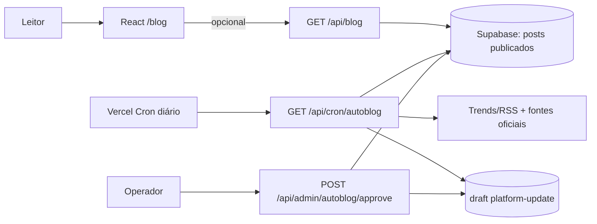

# Autoblog de Tráfego Pago — Design

**Spec**: `.specs/features/autoblog-trafego-pago/spec.md`
**Status**: Approved and implemented

## Architecture Overview

O frontend continua sendo Vite/React e mantém o catálogo estático como fallback. Funções Vercel em `api/` fazem a parte server-side: pesquisa diária, persistência e aprovação. O Supabase fornece as tabelas/RLS; o cron só chama o pipeline quando as variáveis obrigatórias existem.



## Approaches considered

1. **Supabase + funções Vercel (recomendado)**: encaixa no deploy atual, mantém segredos server-side, suporta idempotência/RLS e permite o blog receber posts sem rebuild.
2. **Gerar JSON e fazer commit/deploy diário**: simples no começo, mas exige token de GitHub, rebuild constante e torna aprovação/auditoria mais frágil.
3. **WordPress/headless CMS externo**: editorialmente rico, mas adiciona outra plataforma, credenciais e custo sem existir hoje no projeto.

## Code Reuse Analysis

| Componente | Local | Uso |
| --- | --- | --- |
| Catálogo e tipos de artigo | `src/lib/blog.ts` | Fallback, cards, SEO e contrato visual. |
| Página do blog | `src/components/BlogPage.tsx` | Ajustar para receber catálogo remoto opcional e manter a estrutura editorial. |
| Metadados | `src/lib/seo.ts` | Reutilizar canonical, JSON-LD e descrição W3. |
| Função Vercel existente | `api/track.ts` | Reutilizar estilo de `VercelRequest/VercelResponse`; não compartilhar segredos do Meta CAPI. |
| Configuração de produção | `vercel.json` | Acrescentar somente cron e manter rewrite da SPA. |

## Components and interfaces

### Editorial calendar

- **Location**: `src/lib/editorial-calendar.ts`
- **Purpose**: gerar pauta determinística de 30 dias.
- **Interface**: `getEditorialCalendar(year: number, monthIndex: number): EditorialSlot[]`.
- **Dependencies**: `Intl`/Date nativos.

### Autoblog domain helpers

- **Location**: `api/_lib/autoblog.ts`
- **Purpose**: contratos, normalização XML, allowlist, auth, timezone, slug, status e cliente REST mínimo do Supabase.
- **Interface**: funções puras exportadas para testes e operações server-side.

### Cron route

- **Location**: `api/cron/autoblog.ts`
- **Purpose**: executar uma coleta diária idempotente e criar um draft de update verificável.
- **Failure behavior**: 401 sem segredo; 503 sem configuração; 200 idempotente; 502 se todas as fontes falharem.

### Approval route

- **Location**: `api/admin/autoblog/approve.ts`
- **Purpose**: publicar um draft validado sob Bearer token administrativo.

### Public blog route

- **Location**: `api/blog.ts`
- **Purpose**: devolver somente posts publicados para hidratar o frontend; sem segredo exposto.

### Blog visual identity

- **Location**: `src/components/BlogPage.tsx`
- **Purpose**: reforçar padrão editorial: selo/volume, destaque, arquivo, categorias e CTA, mantendo contraste e a linguagem visual W3.

## Data Models

```typescript
type EditorialSlot = {
  date: string
  time: string
  kind: 'evergreen' | 'platform-update'
  status: 'scheduled' | 'draft'
  title: string
  keyword: string
  intent: 'informational' | 'commercial'
  angle: string
  format: 'guide' | 'checklist' | 'comparison' | 'case-framework' | 'news-analysis'
  cta: string
  keywordSource: 'editorial-seed' | 'daily-signal'
}
```

Supabase:

- `blog_posts`: slug, title, excerpt, content JSON, category, kind, status, source_url, source_collected_at, scheduled_for, published_at.
- `autoblog_signals`: source, title, url, keyword, published_at, collected_at, score, raw_excerpt.
- `autoblog_runs`: run_date unique, status, source_count, draft_count, errors JSON, started_at, completed_at.
- `autoblog_keywords`: keyword, source, score, observed_on, metadata JSON.

## Error handling

| Cenário | Tratamento |
| --- | --- |
| Bearer inválido | HTTP 401, sem efeito colateral. |
| Env obrigatório ausente | HTTP 503 com código estável. |
| Feed timeout/malformado | erro por fonte, continuar; sem candidatos válidos não criar draft. |
| Run duplicado | conflito de chave/consulta idempotente, retorno 200 `already_processed`. |
| Draft inválido | HTTP 422, nenhuma alteração. |
| Banco indisponível | HTTP 502/503 sem fingir publicação. |

## Risks & Concerns

| Concern | Impact | Mitigation |
| --- | --- | --- |
| O frontend é uma SPA e SEO é build-time | Post remoto pode não ser renderizado no HTML inicial | Manter fallback estático, endpoint público e registrar a necessidade de SSR/headless futuro como ideia deferida. |
| Não há auth existente para operador | Endpoint de aprovação pode ser alvo de abuso | Bearer token separado, sem exposição no cliente, validação de payload e RLS; painel completo fica fora de escopo. |
| Trends API alfa/sem acesso | Não há garantia de dados de volume | Marcar seeds como `editorial-seed`, aceitar URL de provider configurável e nunca alegar volume real sem sinal. |
| Fontes RSS mudam formato | Parser pode perder itens | Limite, normalização, erro por fonte, testes com fixtures e allowlist. |
| Cron pode repetir ou sobrepor | Duplicação de drafts | Unique `run_date` + transição de run e checagem antes de criar draft. |
| LLM pode alucinar mudança de plataforma | Risco reputacional | Draft obrigatório, fonte oficial, prompt para não inventar, publicação separada. |
| Projeto não tem testes | Regressão silenciosa | Adicionar `node:test` para domínio/rotas puras e gates build/lint/visual. |

## Tech decisions

| Decision | Choice | Rationale |
| --- | --- | --- |
| Supabase client | REST com `fetch`, sem SDK novo | Evita dependência adicional e mantém service role apenas no server. |
| Cron auth | `Authorization: Bearer CRON_SECRET` | Padrão documentado da Vercel e fácil de validar. |
| News policy | Draft-first | Atualizações de plataforma exigem checagem humana. |
| Trend semantics | Sinal ≠ volume | Evita inventar métricas do Trends API alfa. |
| AI generation | Opt-in `AUTOBLOG_LLM_ENABLED` | Não cria custo ou dependência surpresa. |
